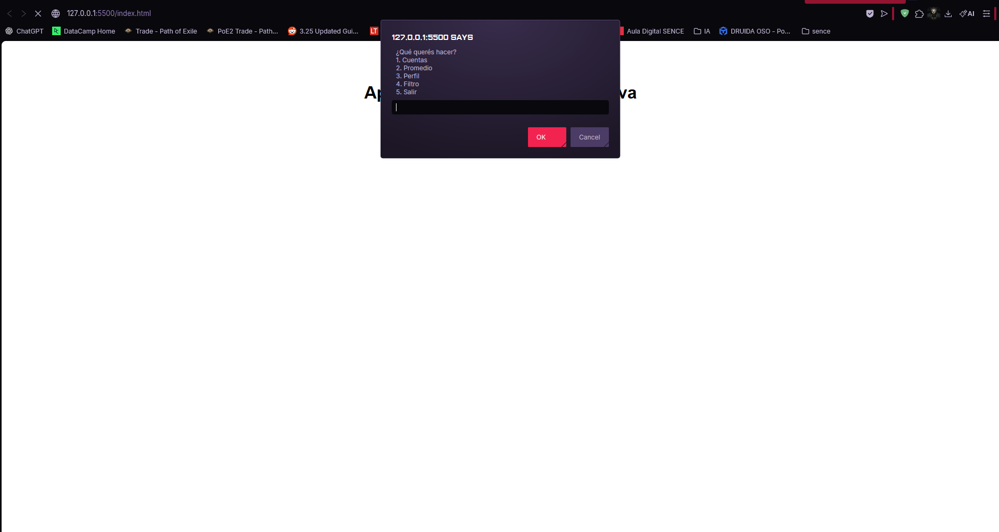
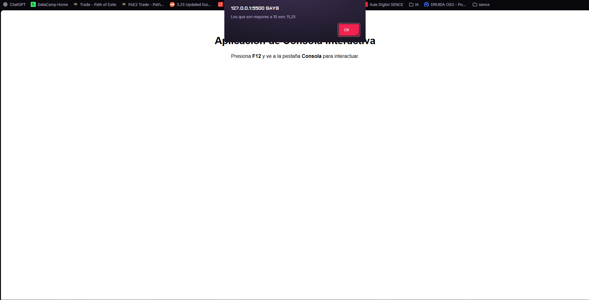

# Proyecto - Módulo JavaScript

##  Descripción

Aplicación de consola desarrollada en JavaScript como proyecto final del módulo.

La aplicación permite al usuario interactuar mediante un menú utilizando `prompt` y `alert`.

##  Funcionalidades

1. Calculadora básica:
   - Suma
   - Resta
   - Multiplicación
   - División (con validación de división por cero)

2. Cálculo de promedio:
   - Permite ingresar múltiples notas
   - Valida datos incorrectos

3. Generador de perfil:
   - Crea un objeto con nombre, edad y profesión
   - Método interno que devuelve una presentación

4. Filtro de números:
   - Devuelve los números mayores a 10
   - Utiliza el método `filter()`

## Tecnologías utilizadas

- HTML5
- JavaScript
- Métodos de arrays (`map`, `filter`)
- Estructuras de control (`while`, `switch`, `if`)

##  Cómo ejecutar el proyecto

1. Descargar el repositorio
2. Abrir el archivo `index.html` en el navegador
3. Interactuar mediante los cuadros de diálogo

##  Capturas

### Screenshot 1

### Screenshot 2

## 📚 Autor

Tu Francisco Soto
